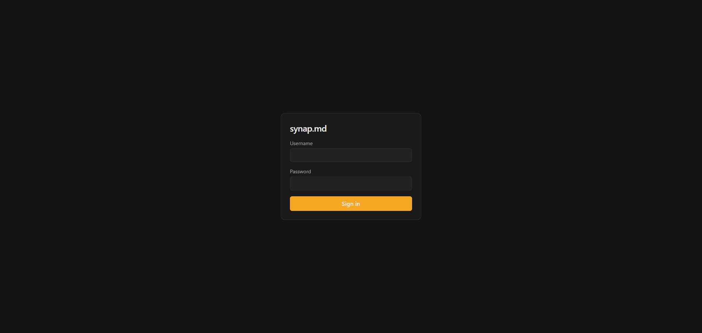
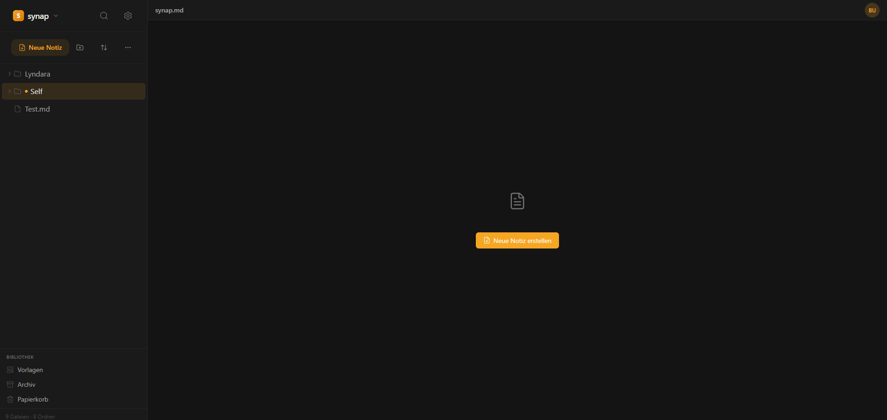
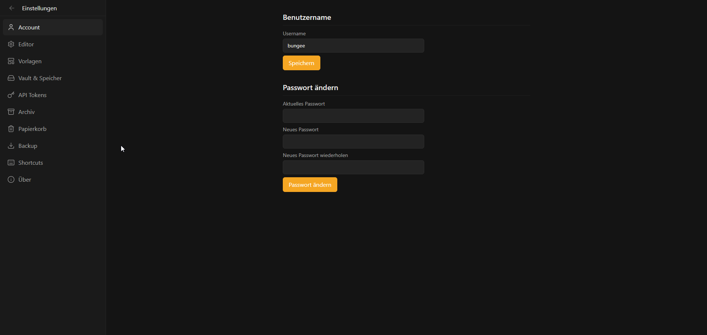

<div align="center">

<div align="center">
  
</div>

**A self-hosted, Obsidian-like Markdown notes app — with a native desktop client that syncs against your own server.**

[](https://github.com/BungeeDEV/synap-monorepo/actions/workflows/ci.yml)
[](LICENSE)
[](https://github.com/BungeeDEV/synap-monorepo/releases)
[](#contributing)

</div>

---

Your notes are plain `.md` files on disk — always. synap.md is a web app and
a desktop client built around that idea: the **vault** (a folder of Markdown
files) is the single source of truth, SQLite is only ever a rebuildable
search index, and everything ships as one self-hosted Docker container with
a single data volume. No external services, no vendor lock-in, no proprietary
file format.

## Features

- 📁 **Vault-based** — your notes are just Markdown files in a folder you
  own; nothing is trapped in a database
- ✍️ **Rich Markdown editor** (Tiptap 3) with slash commands, `[[wikilinks]]`
  with autocomplete, tables, task lists, and a live split/reader view
- 🔍 **Full-text search** over the whole vault (SQLite FTS5)
- 🖥️ **Desktop client** (Tauri 2) that mirrors a vault locally and
  syncs it against a synap.md server — edit offline, sync when you're back
- 🗑️ **Trash & archive** with configurable retention, instead of permanent
  deletes
- 📝 **Templates** and daily notes
- 🌐 **Multi-language UI** — German and English, switchable in Settings
- 🎨 **Customizable theme** — light/dark plus a configurable accent color
- 🔒 **Self-hosted & single-user** — your data never leaves your server
- 🐳 **One container, one volume** — deploy with Docker Compose or
  [Dokploy](https://dokploy.com) in minutes

## Screenshots

<table>
<tr>
<td align="center" width="33%"><br/><sub>Login</sub></td>
<td align="center" width="33%"><br/><sub>Vault</sub></td>
<td align="center" width="33%"><br/><sub>Settings</sub></td>
</tr>
</table>

## Repository structure

This is a [Turborepo](https://turborepo.com)/pnpm monorepo:

| Path                                                   | Description                                                          |
| ------------------------------------------------------ | -------------------------------------------------------------------- |
| [`apps/web`](apps/web)                                 | Nuxt 4 web app + Nitro backend — the synap.md server                 |
| [`apps/desktop`](apps/desktop)                         | Tauri 2 + Vue 3 desktop client                                       |
| [`packages/store`](packages/store)                     | Shared Pinia stores & API client, used by both apps                  |
| [`packages/editor-core`](packages/editor-core)         | Shared Tiptap editor extensions (slash commands, wikilinks, uploads) |
| [`packages/ui-vue`](packages/ui-vue)                   | Shared Vue component library, including the editor UI                |
| [`packages/i18n`](packages/i18n)                       | Shared vue-i18n setup & DE/EN translation catalog, used by both apps |
| [`packages/design-tokens`](packages/design-tokens)     | Shared design tokens (CSS/Tailwind)                                  |
| [`packages/config-tailwind`](packages/config-tailwind) | Shared Tailwind config                                               |
| [`docs`](docs)                                         | Architecture docs (e.g. the web ↔ desktop sync design)               |

## Tech stack

| Layer               | Technology                                                        |
| ------------------- | ----------------------------------------------------------------- |
| Web frontend        | Nuxt 4, Vue 3, TypeScript, Tailwind CSS v4                        |
| Web backend         | Nitro server routes (no separate backend service), better-sqlite3 |
| Desktop shell       | Tauri 2 (Rust)                                                    |
| Desktop sync engine | `rusqlite`, `notify` (filesystem watcher), `reqwest`              |
| Editor              | Tiptap 3, shared byte-for-byte between web and desktop            |
| Tooling             | Turborepo, pnpm workspaces, Vitest, ESLint                        |

## Getting started

### Requirements

- [Node.js](https://nodejs.org) 22+ and [pnpm](https://pnpm.io) 11
- [Rust](https://www.rust-lang.org/tools/install) + the
  [Tauri prerequisites](https://tauri.app/start/prerequisites/) for your OS
  (desktop app only)

### Local development

```bash
git clone https://github.com/BungeeDEV/synap-monorepo.git
cd synap-monorepo
pnpm install

# Web app
cp apps/web/.env.example apps/web/.env
# edit apps/web/.env: point NUXT_VAULT_PATH/NUXT_DATA_PATH at local folders
pnpm --filter synap-md dev

# Desktop app (in another terminal)
pnpm --filter synap-desktop run tauri:dev
```

`pnpm dev` at the repo root starts every workspace app at once via
Turborepo; `pnpm build`, `pnpm test`, and `pnpm lint` run the same way
across the whole monorepo.

### Self-hosting the server

The web app is built to run as a single Docker container against one
`/data` volume. See [`apps/web/README.md`](apps/web/README.md) for the full
Docker Compose and [Dokploy](https://dokploy.com) deployment guide.

## Documentation

- [`docs/sync-plan.md`](docs/sync-plan.md) — the web ↔ desktop sync
  architecture (settled design decisions, not open questions)
- [`apps/web/README.md`](apps/web/README.md) — web app setup & deployment
- [`apps/desktop/README.md`](apps/desktop/README.md) — desktop app setup
  (German)

## Branching model

This repo follows a lightweight Git Flow:

```
feature/*  →  develop  →  main (tagged vX.Y.Z)
```

- **`main`** — stable, released code only. Nothing is committed here
  directly; every tag (`vX.Y.Z`) marks a release point on this branch.
- **`develop`** — integration branch for active development. All finished
  feature/fix branches are merged back into `develop` first.
- **`feature/*`** / **`fix/*`** — one branch per piece of work, branched off
  `develop` and merged back into it (PR or direct merge).
- **Releases** — once `develop` is in a releasable state, it's merged into
  `main` and tagged there.

## Roadmap

There's no formal roadmap doc yet — planned work and open questions are
tracked in [GitHub Issues](https://github.com/BungeeDEV/synap-monorepo/issues).
Feel free to open one if you have an idea, or weigh in on an existing one.

## Contributing

Contributions are welcome — bug fixes, features, docs, or just opening an
issue to discuss an idea.

- Not sure where to start? Check issues labeled
  [`good first issue`](https://github.com/BungeeDEV/synap-monorepo/labels/good%20first%20issue)
- For anything bigger, open an issue first so we can align on the approach
  before you sink time into it
- Dev setup is the same as [Local development](#local-development) above;
  see [`CONTRIBUTING.md`](CONTRIBUTING.md) for PR conventions and the
  branching model in more detail

**Why contribute?** The most interesting open problem in synap.md right now
is the web ↔ desktop sync engine — keeping a local Tauri vault and a
server-backed vault consistent, offline-first, without pulling in a full
CRDT stack. If you're into local-first software, sync engines, or Rust,
[`docs/sync-plan.md`](docs/sync-plan.md) is a good place to start reading.

## License

[MIT](LICENSE) © 2026 Bungee
